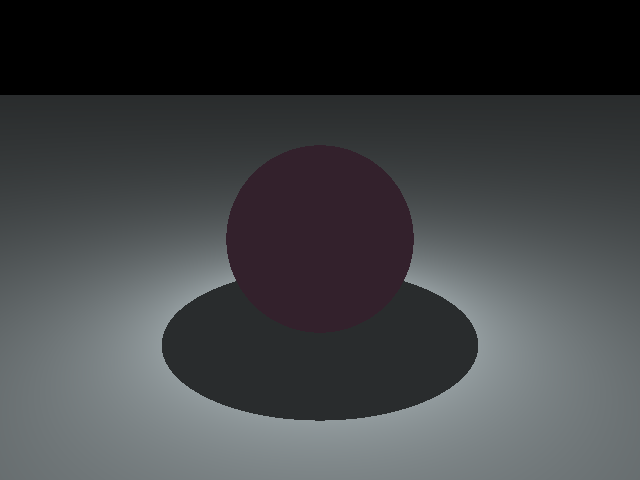
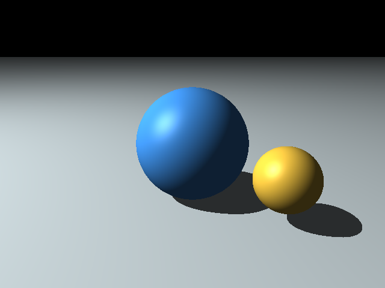
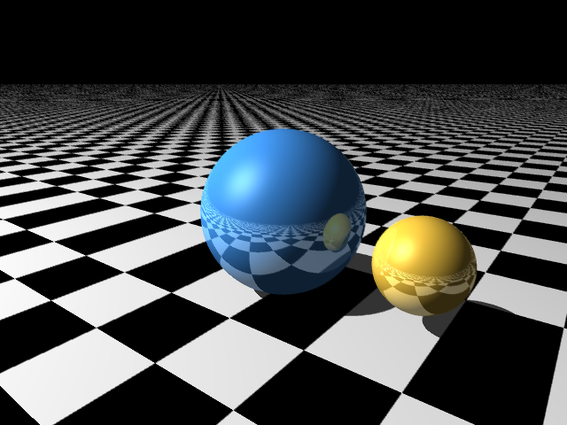

# LOG 

### 11/22/18 

#### main.cpp and 'saveimage()' function

-  to save an image in the folder as jpeg. 

#### First image created and saved

#### Vect.h, Ray.h, Camera.h, Color.h, Light.h

-  vectors (contains linear operations) and rays
-  simulate a camera
-  set colors and light source 
-  scene objects (along with some vector math for ray/object intersection test)

### 11/23/18

#### Sphere.h, Plane.h
-  scene objects (along with some vector math for ray/object intersection test)

#### Rendered first scene with objects (sphere on a plane)

### 11/24/18

#### Efficient Makefile

A Makefile is created (in *src/*) to reinforce efficient folder structure. Whenever `make` is run, it checks .h files (in *src/headers/*) and .cpp files (in *src/*), and create .o files in *src/obj/* if necessary.

### 11/25/18

#### Ray tracer with Shadow (no anti-aliasing)
Ray tracer with shadow generated. Initially, we had a bug which resulted in erroneos shadows.

We were unsuceessful in finding the bug, but re-created a .cpp file for each .h file, which solved the issue. We believe it had something to do with *virtual* functions, though we couldn't trace back the error. We now have a two sphere on a plane, with correct characteristics. 

### 12/02/18

#### Reflections & a floor in checkered pattern (no anti-aliasing)

#### Anti-aliasing (aadepth = 4)

## TO DO 

### Nov 26 : progress report due 

### Nov 28 : finish basic ray-tracer template

### Dec 9 : Implement k-d tree (10 day)

### Nothing new 

### Dec 15 or later : presentation  + submit code & log  + individual reflection due 

