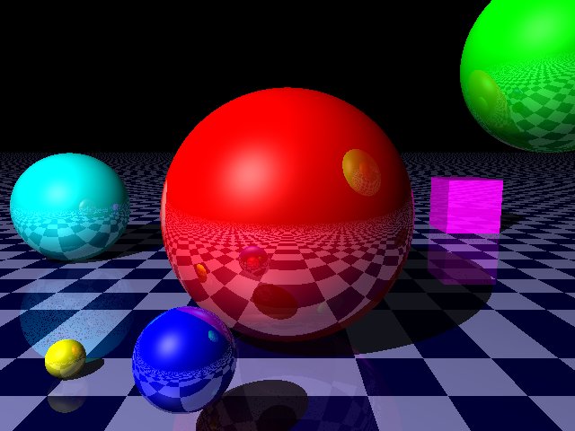

# RayTracer

### Ojashvi Rautela and Kiet Tran

Implementing a ray tracer from scratch in C++.

## Build and run the code

### Windows

1. Download and install [Cygwin](https://cygwin.com/install.html "Cygwin's Download Page"). 

2. Open Cygwin, then run the same commands for Mac and Linux (described in the section right after this one).

3. Instead of running the command `./raytracer`, you can double click on `raytracer.exe` in the `RayTracer/src` folder to run the program.

### Mac and Linux

Open Terminal and run the following commands: 

```
cd your/code/directory
git clone https://github.com/ojashvirautela/RayTracer.git
cd RayTracer/src
make
./raytracer
```

## Overall architecture

**main.cpp**: Render the scene, and save it as a .jpeg image in RayTracer/images/ 

- Create objects on the scene (position, color, reflection).

- For every pixel in the image, create a ray.

- For every ray, call the **getColorAt** function (declared in **App.cpp**), which is our main tracing function.

- Implement anti-aliasing.

**App.cpp**: Contains the helper functions for main.cpp. Some of those functions are:

- **saveImage()**: Save the rendered scene into an image file.

- **closestObject()**: Return the index of the object closest to the camera.

- **getColorAt()**: The main *ray tracing* function. Implement shadows, ambient, diffuse, specular, reflections, refractions, and return the color that should be at each pixel in the image.

**Vect.cpp, Color.cpp, Ray.cpp**: Vector, color, and ray classes.

**Camera.cpp**: Camera position and orientation.

**Light.cpp, Source.cpp**: Light sources.

**Object.cpp, Sphere.cpp, Plane.cpp, Triangle.cpp**: All the objects.

## Important performance issues

TODO: fill this up

## Known bugs

TODO: fill this up

## Latest result

So far, the `raytracer` executable will generate this image (with anti-aliasing depth = 1):

<p align="center">
  
</p>
