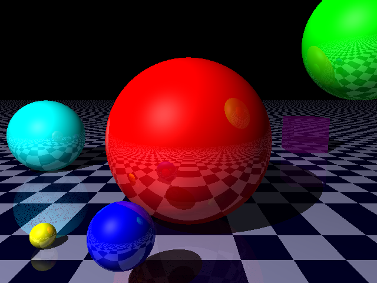

# RayTracer

## Ojashvi Rautela and Kiet Tran

Implementing a ray tracer from scratch.

# Build and run the code

## Windows

1. Download and install [Cygwin](https://cygwin.com/install.html "Cygwin's Download Page"). 

2. Open Cygwin, then run the same commands for Mac and Linux (described in the section right after this one).

3. Instead of running the command `./raytracer`, you can double click on `raytracer.exe` in the `RayTracer/src` folder to run the program.

## Mac and Linux

Open Terminal and run the following commands: 

```
cd your/code/directory
git clone https://github.com/ojashvirautela/RayTracer.git
cd RayTracer/src
make
./raytracer
```

# Overall architecture

TODO: fill this up

# Important performance issues

TODO: fill this up

# Known bugs

TODO: fill this up

# Latest result

So far, the `raytracer` executable will generate this image (with anti-aliasing depth = 1):

<p align="center">
  
</p>
